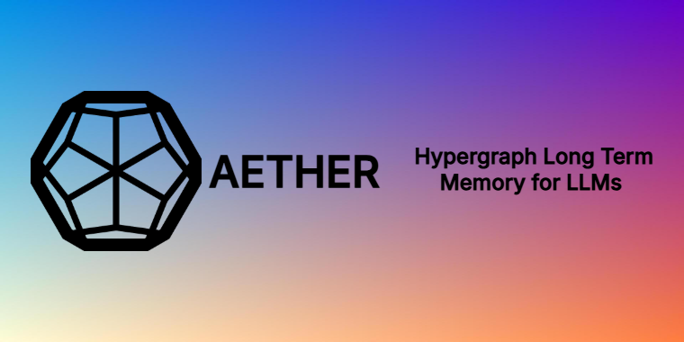

<p align="center">
  
</p>

<p align="center">
  
  
  
  
  
</p>

# Aether: Hypergraph Long Term Memory for LLMs 

Aether is a hypergraph-based long-term memory system designed for Large Language Models. By moving beyond standard flat vector databases, Aether structures user interactions into overlapping contexts (hyperedges) and strongly-typed semantic nodes. This allows AI assistants to retrieve highly relevant, multi-hop information and strictly prioritize timeline updates to prevent hallucinations on stale facts.

## Introduction & Use Cases

Core Capabilities:
* **Hypergraph Retrieval:** Captures implicit relationships by grouping concepts into contextual envelopes rather than rigid 1-to-1 edges.
* **State Tracking:** Automatically detects state changes (e.g., a trip moving from April to May) to prioritize the most current facts over older records.
* **Typed Memory Blocks:** Parses entities, dates, locations, and user preferences into distinct, structured data classes.

## Installation

We recommend using [`uv`](https://github.com/astral-sh/uv) for fast dependency resolution and virtual environment management.

```bash
# Create and activate a virtual environment
uv venv
# On Windows: .\.venv\Scripts\activate
# On Linux: source .venv/bin/activate

# Install the base package
uv pip install -e .
```

## Environment & API Keys

Aether requires an LLM to accurately extract and categorize text into memory blocks. We use Google's Gemini for this extraction layer, alongside Hugging Face's `all-MiniLM-L6-v2` for computing the local graph embeddings. 

Create a `.env` file in the root directory and add your keys:
```ini
GEMINI_API_KEY="your_google_gemini_key"
HF_TOKEN="your_huggingface_token"
```

## Quick Start Guide

Start the Aether backend. This runs the FastAPI server that manages your local hypergraph:

```bash
uv run server.py
```
The application will spin up on `http://127.0.0.1:8000` and automatically create or load your local memory graph file (`saved_graphs/memory.pkl`). Leave this terminal running in the background.

## Chrome Extension Integration

Aether includes a browser extension that allows you to inject your personal hypergraph directly into frontend chat interfaces like ChatGPT, Claude, and Gemini.

**To install:**
1. Open Google Chrome and navigate to `chrome://extensions/`.
2. Toggle **Developer mode** in the top right corner.
3. Click **Load unpacked** and select the `AetherExtension` folder located inside this repository.

**How to use:**
* **Ingest Memory:** Highlight any text on a webpage and press `Ctrl+Shift+S`. The backend will parse the text and compile it into your local hypergraph in the background.
* **Retrieve Context:** Type a question in your AI chat box. Highlight your question and press `Ctrl+Shift+E`. Aether will extract the contextual envelope from your graph and copy the combined prompt directly to your clipboard. Simply press `Ctrl+V` to paste the augmented prompt into the chat and hit send.

---

### Citation
Our formal research paper detailing the hypergraph mathematical structures and latency evaluations is currently in progress and will be available soon.

*\*Note: Aether is an active work in progress. Further support, edge-case refinement, and system improvements are continually being integrated.*
