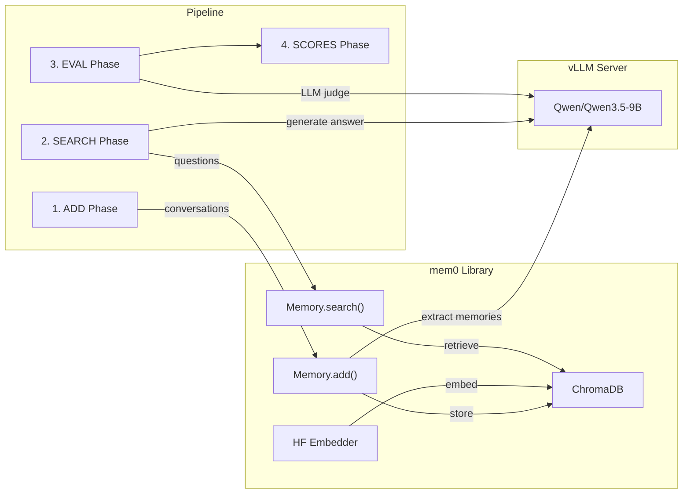

# Mem0 Baseline on LOCOMO Benchmark

## Architecture

The implementation mirrors the [mem0 evaluation reference](https://github.com/mem0ai/mem0/tree/main/evaluation) but replaces all OpenAI API usage with a locally-served vLLM instance running `Qwen/Qwen3.5-9B`.



**Prerequisite**: A vLLM server must be running:

```bash
vllm serve Qwen/Qwen3.5-9B --port 8000
```

## File Structure

All new files go under [locomo_evals/](hyper_aether/locomo_evals/):

```
locomo_evals/mem0_baseline/
  __init__.py
  config.py            # mem0 + vLLM configuration
  mem0_add.py          # ADD phase: ingest conversations into mem0
  mem0_search.py       # SEARCH phase: search memories + generate answers
  prompts.py           # Answer generation prompt templates
  metrics.py           # BLEU, F1, LLM judge scoring functions
  eval.py              # Evaluation orchestrator
  generate_scores.py   # Aggregate scores by category
  run.py               # CLI entry point (like run_experiments.py)
```

## Key Design Decisions

### 1. `config.py` - Central configuration

Defines the `mem0` config dict pointing at the vLLM server and using local HuggingFace embeddings + ChromaDB:

```python
MEM0_CONFIG = {
    "llm": {
        "provider": "vllm",
        "config": {
            "model": "Qwen/Qwen3.5-9B",
            "vllm_base_url": "http://localhost:8000/v1",
            "temperature": 0.1,
            "max_tokens": 2000,
        }
    },
    "embedder": {
        "provider": "huggingface",
        "config": {
            "model": "all-MiniLM-L6-v2",
            "embedding_dims": 384,
        }
    },
    "vector_store": {
        "provider": "chroma",
        "config": {
            "collection_name": "locomo_mem0",
            "path": "./mem0_db",
        }
    }
}
```

Also provides a helper to create an `openai.OpenAI` client pointed at the vLLM server for answer generation and LLM judging.

### 2. `mem0_add.py` - ADD Phase

Follows the reference [add.py](https://github.com/mem0ai/mem0/blob/main/evaluation/src/memzero/add.py):

- Creates `Memory.from_config(MEM0_CONFIG)` instance
- Iterates over LOCOMO conversations
- For each conversation: creates two user IDs (`{speaker_a}_{idx}`, `{speaker_b}_{idx}`)
- Formats messages as role-based chat (user/assistant) with speaker name prefixes
- Includes `metadata={"timestamp": session_date_time}` on each `mem.add()` call
- Includes the `custom_instructions` from the reference for rich memory extraction
- Processes sessions sequentially, adding memories for both speakers per session

### 3. `mem0_search.py` - SEARCH Phase

Follows the reference [search.py](https://github.com/mem0ai/mem0/blob/main/evaluation/src/memzero/search.py):

- For each QA pair, searches both speaker user IDs via `mem.search(question, user_id=...)`
- Formats retrieved memories with timestamps
- Renders the `ANSWER_PROMPT` template with both speakers' memories
- Calls vLLM (via OpenAI-compatible client) to generate a short answer
- Saves results as JSON with fields: `question`, `answer`, `response`, `category`

### 4. `prompts.py` - Answer Prompts

Adapts the reference [prompts.py](https://github.com/mem0ai/mem0/blob/main/evaluation/prompts.py). Uses the `ANSWER_PROMPT` template (non-graph version) with Jinja2 template syntax for speaker memories and question.

### 5. `metrics.py` - Scoring Functions

Combines the reference [metrics/utils.py](https://github.com/mem0ai/mem0/blob/main/evaluation/metrics/utils.py) and [metrics/llm_judge.py](https://github.com/mem0ai/mem0/blob/main/evaluation/metrics/llm_judge.py):

- `calculate_bleu_scores()` - BLEU-1 via NLTK
- `calculate_metrics()` - Token-level F1
- `evaluate_llm_judge()` - LLM judge using vLLM/Qwen instead of `gpt-4o-mini`, prompting the model to return CORRECT/WRONG JSON

### 6. `eval.py` - Evaluation Orchestrator

Follows the reference [evals.py](https://github.com/mem0ai/mem0/blob/main/evaluation/evals.py):

- Reads search results JSON
- Skips category 5 questions
- Computes BLEU, F1, and LLM judge score for each QA pair
- Saves scored results to `evaluation_metrics.json`

### 7. `generate_scores.py` - Score Aggregation

Follows the reference [generate_scores.py](https://github.com/mem0ai/mem0/blob/main/evaluation/generate_scores.py):

- Loads evaluation metrics
- Groups by category, computes mean BLEU/F1/LLM scores
- Prints per-category and overall results

### 8. `run.py` - CLI Entry Point

Provides argparse-based CLI:

```bash
# ADD phase
python -m locomo_evals.mem0_baseline.run --method add

# SEARCH phase
python -m locomo_evals.mem0_baseline.run --method search --top_k 30

# EVAL phase
python -m locomo_evals.mem0_baseline.run --method eval --input_file results/mem0_results.json

# SCORES phase
python -m locomo_evals.mem0_baseline.run --method scores --input_file evaluation_metrics.json
```

## Dependencies to Add

In [pyproject.toml](hyper_aether/pyproject.toml):

- `mem0ai` - the open-source mem0 library
- `chromadb` - local vector store backend
- `openai` - OpenAI-compatible client for talking to vLLM
- `jinja2` - prompt templating
- `nltk` - BLEU score calculation
- `pandas` - score aggregation
- `tqdm` - progress bars
